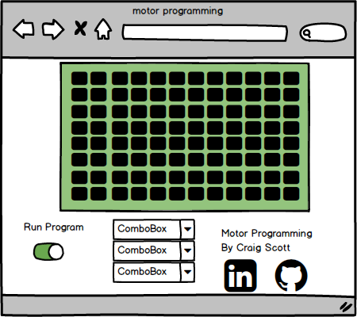

# Project Proposal

## Motor Programming

### Background

Some of my fondest memories of my child hood was playing "The Lost Mind of Dr. Brain" this was a collection of puzzles you had to solve to win the game. One of my favorite puzzles was motor programming. In this puzzle you preset a few commands and then run the "program", the character  moves through a grid picking of the brain and avoiding bugs. An example of the mini game can be found here [Motor Programming][youtube].

[youtube]: https://www.youtube.com/watch?v=xqDGPYMcWGk&t=583s

### Functionality & MVP

- [ ] When started runs through predetermined sequence.
- [ ] User can input command and run through them.
- [ ] 4 levels available and will continue to the next one after once one is completed.
- [ ] Production README.

### Wireframe

The game will consist of 4 main components the map the movement drop downs the run switch and the information area including title credit and links to my linkedin and github pages.

### Architecture and Technologies

-I will use vanilla JavaScript for the overall structure of the game including movment and logic.
-I will use webpack to bundle all the scripts.
-I plan to use canvas to render the images on the screen.

### Implementation Timeline

**Day 1**:

- setup file structure.
- build inputs and test functionality with console logs.
- play with canvas to figure out its use.

**Day 2**

- work out movements and other actions and how they interact with the environment.
- add images to the different pieces.

**Day 3**

- build out puzzles and test functionality.

**Day 4**

- styling and resolve any issues that have cone to the surface.

### Bonus features

- [ ] More maps
- [ ] a subroutine
- [ ] extra visual embellishment 
