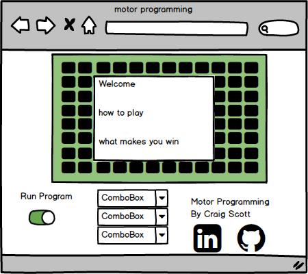

# Project Proposal

## Motor Programming

### Background

Some of my fondest memories from my childhood were while playing "The Lost Mind of Dr. Brain". This computer game is a collection of puzzles you had to solve in order to win. One of my favorite puzzles was motor programming. In this puzzle the player would preset a few commands and then run the "program", the character  moves through a grid picking up the brain and avoiding bugs. An example of the mini game can be found here [Motor Programming][youtube].

[youtube]: https://www.youtube.com/watch?v=xqDGPYMcWGk&t=583s

### Functionality & MVP

- [ ] When started runs through predetermined sequence.
- [ ] User can input command and run through them.
- [ ] Production README.

### Wireframe

The game will consist of 4 main components, the map, the movement drop downs, the run switch, and the information area including title credit and links to my linkedin and github pages.

The main game field will be a grid of 7 by 11 squares. The input fields will be a series of drop-downs so that the user can pick out the commands. There will be a pop up that instructs the user to run the program and notice how the inputs dictate the movements, and that they have the ability to manipulate the input boxes.

### Architecture and Technologies

- I will use vanilla JavaScript for the overall structure of the game including movment and logic.
- I will use webpack to bundle all the scripts.
- I plan to use canvas to render the images on the screen.

### Implementation Timeline

**Day 1**:

- Setup file structure.
  - index.html
  - webpack.config
  - lib
    - main.js
    - bundle.js
    - actions.jss
  - assets
  - css

- Build inputs and test functionality with console logs. This will show that the inputs are being received and are usable in the code.
- Play with canvas to figure out its use.

**Day 2**

- Work out movements and other actions and how they interact with the environment.
- Add images to the different pieces.

**Day 3**

- Build out puzzles and test functionality.

**Day 4**

- Styling
- Resolve any issues that have cone to the surface.

### Bonus features

- [ ] 4 levels available and will continue to the next one after once one is completed.
- [ ] A subroutine
- [ ] Extra visual embellishment
